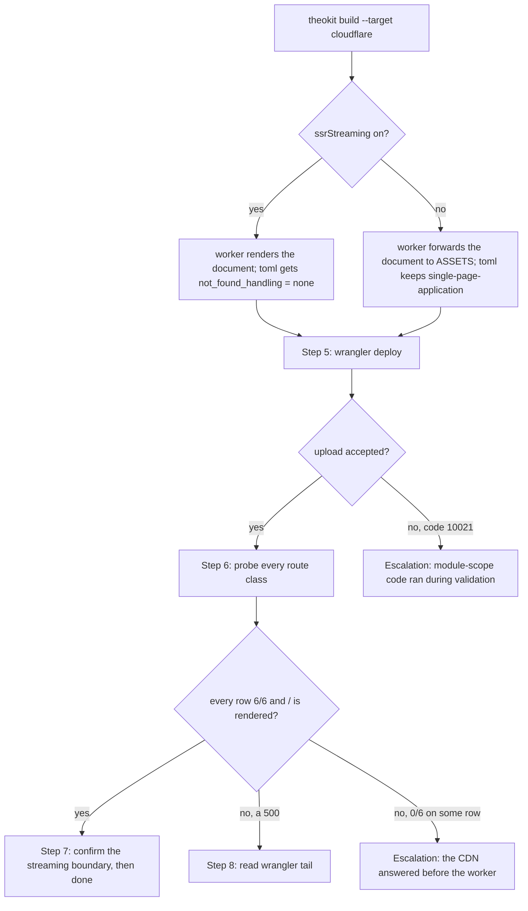

# Deploy a TheoKit application to Cloudflare Workers

## Purpose

Put a TheoKit app on Cloudflare Workers and **prove it answers**, because five of the defects
between a green build and a working URL are invisible to every gate that runs before the deploy.

Written from the first real deploy this repository ever performed, 2026-09-26. Every number and
every error below was measured, not predicted.

## Prerequisites

- [ ] `wrangler` reachable and authenticated — `npx wrangler whoami` prints an account.
- [ ] The app builds for Node first — `npx theokit build` exits 0. A Cloudflare build that fails on
      something the Node build also fails on is not a Cloudflare problem.
- [ ] The `theokit` version in the project carries commits `7245e69ed`, `94fc29c4e` and `79fd5dd11`.
      Below those, the worker does not upload at all — see § What each fix bought, and why.
- [ ] A worker name decided. The generated `wrangler.toml` writes `name = "theo-app"` and **the
      build overwrites that file on every run**, so the name is re-applied per build (step 4).

## Steps

1. **Confirm** who will receive the worker — `npx wrangler whoami`. A deploy to the wrong account
   creates a live URL under a name you will not think to look for.
2. **Declare** the rendering mode in `theo.config.ts`. `ssrStreaming` defaults to `false`, and
   **both flags are required** — `schema.ts` applies streaming only when `ssr` is also true:
   ```ts
   export default config().set({ ssr: true, ssrStreaming: true }).build()
   ```
   With streaming off the worker forwards the document to the asset binding instead of rendering it;
   both paths work and they produce different `wrangler.toml` (§ Decisions).
3. **Build** for the target — `npx theokit build --target cloudflare`. The flag is `--target`, not
   `--adapter`; without it the build silently produces the **node** adapter and prints
   `✓ Build complete → node (SSR)`. Read that line before continuing.
4. **Set** the worker name in the generated `wrangler.toml`, which the previous step just
   overwrote — `sed -i 's/^name = "theo-app"$/name = "your-worker"/' wrangler.toml`.
5. **Deploy** — `npx wrangler deploy`. Expect `Uploaded <name>` and a `Current Version ID`. A
   validation error here is **not** a bundling error; go to § Escalation.
6. **Probe** one route of every class, and read the headers rather than the status alone:
   ```bash
   U=https://your-worker.<subdomain>.workers.dev
   for P in / /dashboard /robots.txt /favicon.svg /api/health /api/nope; do
     H=$(curl -s -o /tmp/b -D - "$U$P")
     printf '%-16s %s  sec=%s/6  %sB\n' "$P" \
       "$(echo "$H" | head -1 | awk '{print $2}')" \
       "$(echo "$H" | grep -icE '^(content-security-policy|x-frame-options|x-content-type-options|referrer-policy|permissions-policy|strict-transport-security):')" \
       "$(wc -c < /tmp/b)"
   done
   ```
   A correct deploy of an SSR app returns **6/6 on every row**, including the static files.
7. **Verify** the document is rendered and not merely served — a 200 proves neither:
   ```bash
   curl -s "$U/" | grep -c '<!--\$-->'          # React Suspense boundary: streaming happened
   curl -s "$U/" | grep -oE '<script[^>]*src="/assets/[^"]*"'   # the client entry is linked
   ```
   Measured here: `/` went from **529 bytes with an empty `<div id="root">` and 0/6 headers** to
   **14889 bytes with 3546 chars of React output and 6/6**. The 529-byte version was a 200.
8. **Read** the real exception whenever a route answers 500 — never infer it:
   ```bash
   npx wrangler tail --format json > /tmp/tail.json &   # then hit the route, then stop it
   awk '/"exceptions"/,/\]/' /tmp/tail.json
   ```
   The output is **pretty-printed multi-line JSON, not JSONL**, so a per-line parser reads nothing
   and reports no exceptions over a file that contains one.

## Decisions



## Escalation

- **Upload refused with `code 10021` and a `TypeError` naming `fileURLToPath` or `createRequire`** →
  a module resolved `import.meta.url` or `__filename` at **module scope**, and Cloudflare executes
  the top-level module during validation. Move the resolution inside the function that needs it.
  When the module is a dependency rather than yours, file it upstream and stop: no bundler flag
  fixes `undefined`.
- **Upload refused naming a `.node` file** → workerd cannot load a native addon at any bundler
  setting. Find the import that drags it (a deprecated umbrella export is the usual carrier) and
  replace it with the narrow subpath.
- **An app declaring an agent will not upload** → `@theokit/sdk` resolves `__dirname` at module
  scope, in **5.9.0 and 5.9.1 alike**. Tracked as `usetheokit/theokit-sdk#705`; deploy without
  agents until it lands, and say so rather than reporting the target as clean.
- **`/` answers 200 with an empty `<div id="root">` and no security headers** → Cloudflare's asset
  handler answered before the worker, so the code that renders the page and stamps the headers never
  ran. Confirm `run_worker_first` is in the generated `wrangler.toml`; if it is absent, the `theokit`
  version predates commit `94fc29c4e`.
- **A static file answers 500 while `/` is fine** → something stamped headers onto a Response it did
  not construct. A Response from a binding carries an immutable headers guard, and mutating one
  throws `Can't modify immutable headers.` Rebuild the Response instead of editing it.
- **`/api/agents/<name>` answers 404 while the agent file exists** → the agents scan found nothing.
  Read the build output for `agentsDir … which is not a directory`; a doubled path segment
  (`src/src/...`) means the `theokit` version predates commit `79fd5dd11`.
- **`wrangler deploy --dry-run` passed and the real deploy failed** → expected, not a contradiction.
  The dry run bundles and does not execute. Treat its exit 0 as proof the bundle links and nothing
  more.

## Competencies

| Competency | Who may perform | How it is verified |
|---|---|---|
| Running the deploy | anyone with wrangler authenticated to the account | `npx wrangler whoami` prints the intended account before step 5 |
| Reading a validation refusal | anyone on the framework | has produced the § Escalation stack trace once, from `wrangler tail` rather than from the CLI summary |
| Judging that the document is rendered | anyone on the framework | can state the byte size AND the Suspense-boundary count for the same URL |
| Declaring a target validated | the owner of this SOP | the step-6 table is recorded with all six header counts, and every unexercised route class is named with its reason |

## What each fix bought, and why no earlier gate saw it

Five defects stood between `theokit build --target cloudflare` and a URL that answered. Three
blocked the upload; two were only visible in the live response. Recorded because each one costs a
deploy cycle to rediscover.

| # | Defect | Why it was invisible |
|---|---|---|
| 1 | the worker imported the Vite virtual id `/@theo/entry-server` | esbuild bundles the worker and has no Vite plugin to resolve it |
| 2 | the worker imported the deprecated `theokit/server` umbrella, dragging `@swc/core`'s `.node` addon | workerd cannot load a native addon at any setting |
| 3 | three scanners called `createRequire(import.meta.url)` at module scope | validation executes the module; `--dry-run` does not |
| 4 | `wrangler.toml` never set `run_worker_first`, so the CDN answered `/` | the precedence is Cloudflare's request routing, not a property of the bundle |
| 5 | security headers were stamped onto a Response from a binding | fix 4 was what made that branch reachable for the first time |

Fix 4 is the one worth internalising: **it made fix 5 possible**. The asset branch had shipped and
never executed, so it carried the defect density of code nobody had run while looking like code that
had been in production for months.

## What this procedure does NOT establish

- **Rate limiting.** No `ratelimit-*`, `x-ratelimit-*` or `retry-after` header appears on any
  response from this target. Measured on all six route classes; stated here because an absence
  nobody wrote down gets rediscovered as a bug.
- **Agents.** Blocked upstream (§ Escalation). `/api/agents/<name>` has never answered on this
  target.
- **The other targets.** Vercel, Netlify, AWS Lambda, Deno Deploy and Bun share the adapter layer
  and none of the five defects above was specific to Cloudflare except #4. Fix 5 in particular lives
  in code all six targets call.
